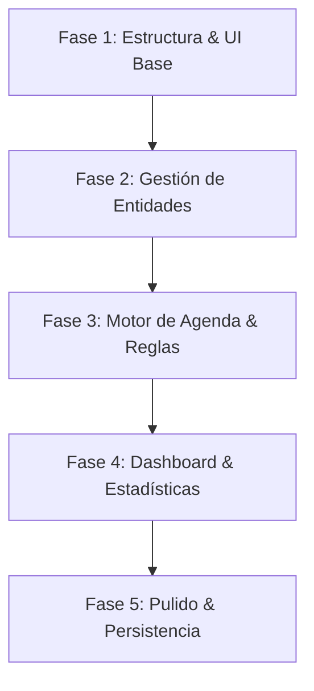

# Documento de Requerimientos - Sistema de Gestión de Citas Médicas

Este documento detalla el análisis, requerimientos y la planificación lógica para el desarrollo de la aplicación web local de gestión y agenda de citas médicas.

---

## 1. Objetivo de la Aplicación

El objetivo es desarrollar una aplicación web local, moderna e intuitiva que permita a consultorios médicos o clínicas independientes gestionar de manera eficiente la información de sus pacientes, el directorio de médicos y la programación de citas, previniendo conflictos de horarios y optimizando la atención al paciente.

---

## 2. Requerimientos Funcionales (RF)

Los requerimientos funcionales definen los servicios y funciones específicos que la aplicación debe ofrecer.

### RF-01: Gestión de Médicos
*   **Registro de Médicos:** Crear perfiles de médicos especificando: Nombre Completo, Especialidad, Teléfono, Correo Electrónico y Horarios de Atención (días y horas disponibles).
*   **Visualización y Edición:** Un panel para listar a todos los médicos, buscar por especialidad o nombre, y editar o eliminar sus perfiles.

### RF-02: Gestión de Pacientes
*   **Registro de Pacientes:** Crear perfiles de pacientes con: Nombre Completo, Documento de Identidad (DNI/Cédula), Fecha de Nacimiento, Teléfono, Correo Electrónico y Notas Médicas Alérgicas/Historial Rápido.
*   **Búsqueda Rápida:** Buscador en tiempo real por nombre o documento de identidad.

### RF-03: Agenda y Programación de Citas
*   **Calendario Interactivo:** Vista de calendario (mensual, semanal y diario) para visualizar visualmente la distribución de citas.
*   **Creación de Citas:** Formulario para agendar una cita seleccionando un paciente registrado, un médico, la fecha, hora de inicio, duración estimada y motivo de la consulta.
*   **Validación de Disponibilidad (Regla de Negocio Crítica):** El sistema debe impedir el agendamiento si:
    *   El médico ya tiene otra cita en el mismo rango de horas.
    *   La hora seleccionada está fuera del horario de atención configurado para el médico.
*   **Gestión de Estados:** Cambiar el estado de las citas (Programada, En Curso, Completada, Cancelada, No asistió).

### RF-04: Panel de Control (Dashboard) e Indicadores
*   **Resumen Diario:** Visualización rápida de las citas programadas para el día actual.
*   **Métricas Rápidas:** Indicadores sobre el número total de pacientes, citas activas del día y porcentaje de ocupación médica.

---

## 3. Requerimientos No Funcionales (RNF)

Los requerimientos no funcionales determinan los atributos de calidad, rendimiento y experiencia de usuario del sistema.

### RNF-01: Experiencia de Usuario y Diseño Visual (UI/UX Premium)
*   **Estética Moderna:** Interfaz limpia con una paleta de colores armoniosa (ej. azules médicos, grises suaves y acentos vibrantes para estados), tipografía legible (como *Inter* u *Outfit*) y soporte para Modo Oscuro/Claro.
*   **Micro-animaciones:** Transiciones fluidas al abrir modales, cambiar de pestaña o guardar información para mejorar el flujo percibido.
*   **Adaptabilidad (Responsive):** Diseño completamente adaptable para funcionar en pantallas de escritorio, tabletas y dispositivos móviles.

### RNF-02: Persistencia de Datos
*   **Almacenamiento Local:** Los datos deben persistir de manera local utilizando tecnologías del navegador (como `localStorage` o `IndexedDB`) o una base de datos local ligera (como SQLite), permitiendo que la app funcione sin conexión a Internet externa.

### RNF-03: Rendimiento y Velocidad
*   **Cargas Instantáneas:** La navegación entre el calendario y los registros de pacientes/médicos debe ser inmediata (arquitectura SPA - Single Page Application).
*   **Búsquedas Eficientes:** La búsqueda y filtrado de registros debe realizarse del lado del cliente en tiempo real.

### RNF-04: Seguridad y Privacidad Local
*   **Validación de Formularios:** Sanitización y validación estricta de todos los campos de entrada para evitar inconsistencias en las citas y asegurar que los datos del paciente se almacenen con formatos correctos (teléfonos, correos, fechas).

---

## 4. Plan de Implementación Lógico (Fases de Desarrollo)

Para construir la aplicación de forma sólida y ordenada, se propone la siguiente secuencia de desarrollo:

### Fase 1: Estructura, Diseño y UI Base
*   Diseño del sistema de diseño (colores, fuentes, componentes base como botones, inputs y tarjetas).
*   Desarrollo de la estructura principal (Layout con navegación lateral/superior reactiva).
*   Implementación de las vistas contenedoras vacías con estados de carga atractivos.

### Fase 2: Gestión de Entidades (Médicos y Pacientes)
*   Creación de las interfaces para agregar, listar, editar y eliminar **Médicos**.
*   Creación de las interfaces para agregar, listar, editar y eliminar **Pacientes**.
*   Implementación de la validación inicial de los datos de entrada.

### Fase 3: Motor de Agenda y Calendario
*   Integración del calendario interactivo (mensual, semanal, diario).
*   Desarrollo del formulario para agendar citas (vinculando médicos y pacientes ya registrados).
*   Programación del motor de detección de conflictos horaria y límites de horario de atención de los médicos.

### Fase 4: Panel de Control (Dashboard) y Filtros
*   Desarrollo del Dashboard principal con las métricas clave y citas de hoy.
*   Filtros avanzados en la vista de agenda (filtrar por especialidad, por médico específico o por estado de cita).

### Fase 5: Persistencia, Micro-interacciones y Pulido Final
*   Configuración del almacenamiento de datos (para asegurar que la información no se pierda al recargar la página).
*   Añadir transiciones, micro-animaciones, manejo de errores visuales y notificaciones toast de éxito/advertencia.
*   Pruebas finales de flujo y validaciones cruzadas.
