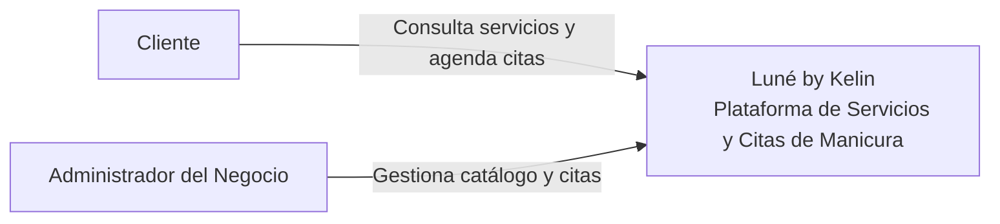
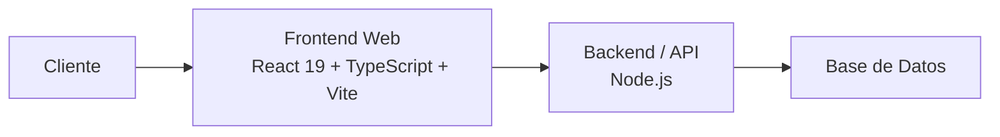

# Arquitectura - Luné by Kelin

## C4 Nivel 1 - Contexto

### Justificación de decisiones

1. Se centralizó la experiencia de cliente y administración en una única plataforma para mejorar la mantenibilidad.
2. Un sistema unificado reduce la duplicación de lógica y facilita la evolución del producto.
3. Se priorizó la usabilidad mediante una aplicación web accesible desde cualquier navegador.
4. La separación entre usuarios clientes y administradores mejora la claridad de responsabilidades.
5. Esta arquitectura facilita futuras integraciones con servicios externos de pagos o notificaciones.

---

## C4 Nivel 2 - Contenedores

### Justificación de decisiones

1. Se eligió React porque favorece la mantenibilidad mediante componentes reutilizables.
2. TypeScript fue seleccionado para aumentar la calidad del código y reducir errores en tiempo de desarrollo.
3. La separación Frontend y Backend mejora la escalabilidad del sistema.
4. Se priorizó mantenibilidad sobre optimización prematura permitiendo una arquitectura sencilla de evolucionar.
5. El aislamiento de la capa de datos permite cambiar la tecnología de almacenamiento con bajo impacto.

---

## Correcciones realizadas al borrador generado con IA

1. La IA propuso servicios de correo electrónico externos que actualmente no están documentados en el proyecto.
2. Se eliminaron integraciones no evidenciadas en el repositorio.
3. La IA asumió tecnologías de base de datos específicas que no aparecen en la documentación actual.
4. Se ajustaron los contenedores para reflejar únicamente React, TypeScript, Vite y la estructura Backend descrita en el proyecto.
5. Los diagramas fueron simplificados para mantener consistencia con la implementación y documentación disponible.