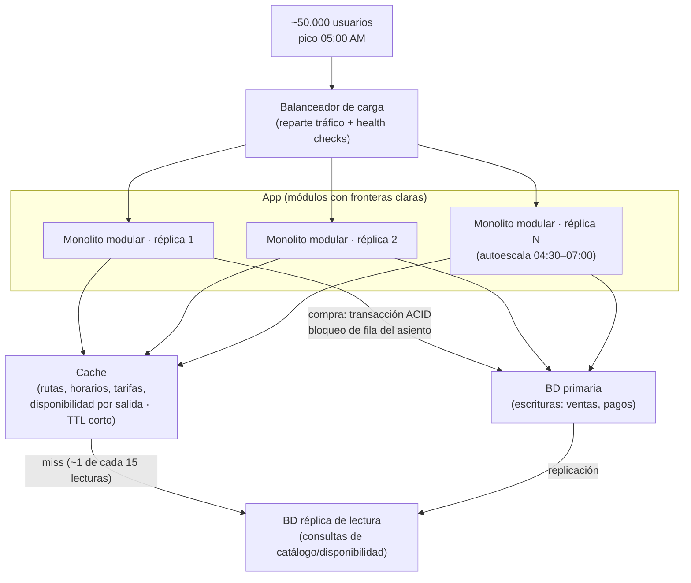

# ADR-001: Arquitectura de la plataforma de venta de boletos

- **Estado:** Aceptada
- **Fecha:** 2026-09-07
- **Autores:** jespinalmontenegro@gmail.com
- **Contexto del sistema:** Cooperativa de buses (capstone SE1)

---

## Contexto

La plataforma pasó de un piloto a **~50,000 usuarios registrados**. El patrón de
carga real es lo que manda la decisión:

- **Pico diario a las 5:00 AM**: cientos de usuarios abren la app casi al mismo
  tiempo para comprar el boleto del primer turno. La mayoría **consulta rutas,
  horarios y disponibilidad** varias veces antes de pagar.
- **Relación lectura/escritura estimada ≈ 15:1**. Se consulta muchísimo, se
  compra poco (una compra por usuario por viaje).
- Los datos que se leen (rutas, horarios, tarifas, mapa de asientos por salida)
  **cambian con baja frecuencia**: se editan una vez al día por el personal de la
  cooperativa.
- **Un solo equipo de 3–4 desarrolladores**. No hay varios equipos que necesiten
  desplegar de forma independiente.
- La venta de un asiento **no puede duplicarse**: se necesita consistencia fuerte
  en la transacción de compra (un asiento = un comprador).

### Atributos de calidad priorizados

| # | Atributo | Por qué en este caso | Métrica objetivo |
|---|----------|----------------------|------------------|
| 1 | **Rendimiento / escalabilidad de lectura** | El 90 % del tráfico y todo el pico de las 5 AM son consultas repetidas de datos casi estáticos. | p95 de consulta de rutas/disponibilidad < 300 ms durante el pico. |
| 2 | **Disponibilidad en ventana crítica** | Si la app cae entre 4:45 y 6:00 AM, la cooperativa pierde la venta del día y la confianza del usuario. | ≥ 99.9 % en la ventana 04:30–07:00. |
| 3 | **Consistencia de la compra** | Vender dos veces el mismo asiento es un fallo de negocio inaceptable. | 0 asientos con doble asignación. |
| 4 | **Mantenibilidad con equipo pequeño** | 3–4 personas no pueden operar una malla de servicios distribuidos. | Un desarrollador nuevo despliega en < 1 día. |
| 5 | **Costo de operación** | Es una cooperativa, no una big tech. El presupuesto de infra es limitado. | Infra mensual proporcional al tráfico, sin pagar 24/7 por capacidad ociosa. |

**No priorizados** (conscientemente): despliegue independiente por equipo,
poliglotismo tecnológico, escala a millones de usuarios. Hoy no son problemas
reales y optimizar para ellos añade costo sin beneficio.

---

## Opciones consideradas

### Opción A — Monolito modular (un despliegue, módulos con fronteras claras)

Una sola aplicación desplegable, organizada internamente en módulos
(`catalogo`, `disponibilidad`, `ventas`, `pagos`, `usuarios`) con interfaces
explícitas y base de datos única.

**Pros para este caso**
- El problema dominante (lectura repetida de datos casi estáticos) se resuelve
  con **una capa de cache delante de un solo servicio**: simple y barato.
- Consistencia de compra trivial: transacción ACID en la misma base de datos,
  sin sagas ni compensaciones.
- Un equipo de 3–4 lo mantiene y despliega sin plataforma de orquestación.
- Escala horizontal real: varias réplicas del mismo binario detrás de un
  balanceador cubren el pico de las 5 AM.
- Costo bajo: se escala el número de réplicas solo en la ventana pico.

**Contras para este caso**
- Un bug grave puede tumbar todo el proceso (se mitiga con réplicas + health
  checks + despliegue gradual).
- Todo el equipo trabaja sobre el mismo código: requiere disciplina en las
  fronteras de módulos para no degradar a "gran bola de lodo".
- Escalar un módulo obliga a escalar todo el proceso (aceptable: el binario es
  liviano y el cuello real es la base de datos y la cache, no la CPU de la app).

### Opción B — Microservicios (servicios independientes, un despliegue cada uno)

`catalogo-svc`, `disponibilidad-svc`, `ventas-svc`, `pagos-svc`, `usuarios-svc`,
cada uno con su base de datos y su ciclo de despliegue, comunicados por red.

**Pros para este caso**
- `disponibilidad-svc` podría escalarse de forma aislada para el pico.
- Aislamiento de fallos entre dominios si la red y los timeouts están bien
  configurados.

**Contras para este caso**
- **La compra cruza `disponibilidad`, `ventas` y `pagos`**: con bases separadas
  se necesita una saga distribuida para no vender dos veces un asiento. Eso
  convierte el atributo #3 (consistencia) de "trivial" en "el problema más
  difícil del sistema".
- Sobrecarga operativa (service discovery, tracing distribuido, versionado de
  contratos, CI/CD por servicio) **para un equipo de 3–4** que no tiene esa
  capacidad de operación.
- La latencia de las llamadas entre servicios juega **en contra** del atributo
  #1 justo en el pico.
- Más puntos de fallo, no menos, en la ventana crítica (#2).
- Costo mayor: más instancias corriendo 24/7, más observabilidad.
- Beneficio principal de microservicios —despliegue independiente por equipo—
  **no aplica**: hay un solo equipo.

### Opción C — Serverless (funciones gestionadas + base de datos gestionada)

Endpoints como funciones (FaaS) tras un API Gateway, base de datos gestionada,
escalado automático por invocación.

**Pros para este caso**
- Escala automática al pico de las 5 AM sin gestionar réplicas.
- Se paga por uso: fuera del pico el costo tiende a cero (bueno para #5).
- Casi nada de operación de infraestructura.

**Contras para este caso**
- **Cold starts** en el arranque abrupto del pico: cientos de invocaciones
  simultáneas tras horas de inactividad es el peor escenario para FaaS y golpea
  directo a #1 y #2.
- La transacción de compra con bloqueo de asiento encaja mal con funciones sin
  estado y conexiones efímeras a la base (agotamiento de pool de conexiones).
- Depuración y pruebas locales más difíciles; el equipo no tiene experiencia.
- Riesgo de acoplamiento fuerte a un proveedor (lock-in) en la capa de cómputo.

---

## Decisión

**Se adopta la Opción A: monolito modular desplegado en varias réplicas detrás de
un balanceador, con una capa de cache para lecturas y una réplica de lectura en
la base de datos.**

Justificación por atributos:

- **#1 Rendimiento de lectura** — Nuestro problema no es de *organización de
  equipos*, es de *lectura repetida de datos casi estáticos*. Eso se ataca con
  **cache**, no partiendo el sistema en servicios. Un `GET /rutas` o
  `GET /disponibilidad/{salida}` servido desde cache responde en milisegundos y
  absorbe el pico de las 5 AM.
- **#2 Disponibilidad** — Menos piezas móviles = menos modos de fallo. Varias
  réplicas idénticas detrás del balanceador dan redundancia sin coordinación
  distribuida.
- **#3 Consistencia de compra** — Una sola base de datos permite una transacción
  ACID con bloqueo de fila del asiento. Sin sagas, sin compensaciones, sin
  estados intermedios inconsistentes.
- **#4 Mantenibilidad** — Un equipo de 3–4 despliega un artefacto, no una malla.
  Las fronteras de módulo preparan una futura extracción de servicios **si y
  cuando** aparezca la necesidad real (p. ej. otro equipo, o un dominio con
  escala radicalmente distinta).
- **#5 Costo** — Se añaden réplicas solo en la ventana 04:30–07:00 (autoescalado
  por horario/CPU) y se reducen el resto del día.

Microservicios se rechaza porque su beneficio central (despliegue independiente
por equipo) no existe hoy y su costo (consistencia distribuida en la compra,
operación) ataca justo nuestros atributos prioritarios. Serverless se rechaza por
los cold starts en un pico frío y por el mal encaje de la transacción de compra.

> "Microservicios porque es lo moderno" no es un argumento. El argumento es:
> nuestro cuello de botella es lectura, se resuelve con cache sobre un monolito
> modular, y la compra necesita una transacción local, no una saga.

---

## Palancas de escala de la decisión

**Por qué cada palanca (y no otras):**

| Palanca | Justificación | Qué NO se usa y por qué |
|---------|---------------|------------------------|
| **Cache de lecturas** | Ataca directamente el atributo #1: datos casi estáticos leídos ~15× por compra. Es la palanca de mayor impacto/costo. | — |
| **Balanceo + réplicas horizontales** | Absorbe la concurrencia del pico de las 5 AM y da redundancia para #2. | Autoescalado agresivo 24/7: innecesario, el pico es predecible por horario. |
| **Réplica de lectura de la BD** | Los *cache miss* y los reportes no deben competir con las escrituras de compra. | Sharding / BD distribuida: el volumen de escritura (una compra por viaje) no lo justifica. |
| **BD primaria única para escrituras** | Hace trivial el atributo #3: la compra es una transacción local con bloqueo de asiento. | Colas de eventos / saga: solo añaden estados inconsistentes que aquí no necesitamos. |

---

## Consecuencias

**Lo que ganamos**
- Camino más corto entre "problema real" (lectura repetida) y "solución" (cache).
- Consistencia de compra sin complejidad distribuida.
- Operable por un equipo de 3–4 personas.
- Costo de infra proporcional al tráfico real.

**Lo que aceptamos perder**
- **Despliegue independiente por dominio**: un cambio en `pagos` obliga a
  redeployar toda la app. Aceptable con un solo equipo y despliegues graduales.
- **Aislamiento total de fallos entre módulos**: un fallo grave en memoria puede
  afectar al proceso. Se mitiga con réplicas, health checks y límites de recursos
  por módulo, no se elimina.
- **Escalado independiente por módulo**: si mañana `disponibilidad` necesitara
  10× más capacidad que el resto, hoy escalaríamos todo el binario. Es barato
  ahora; si deja de serlo, ese módulo es el primer candidato a extraerse.
- **Poliglotismo**: todo el sistema queda atado a un stack. No es una necesidad
  actual.

**Señales que dispararían revisar este ADR**
- Aparece un segundo equipo que necesita cadencia de despliegue propia.
- Un módulo concreto domina el consumo de recursos de forma sostenida.
- La tasa de escritura deja de ser "una compra por viaje" (p. ej. reventa,
  reservas temporales masivas).
- El pico deja de ser predecible por horario.
